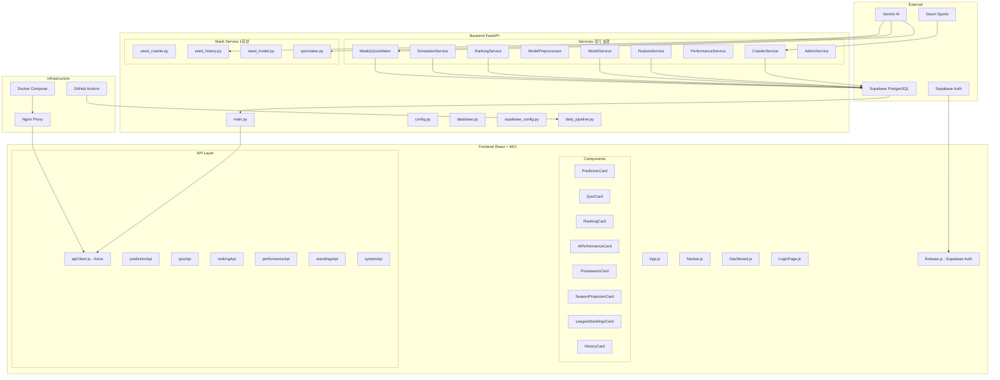

# Laions 프로젝트 종합 점검 보고서

> **점검일**: 2026-05-15
> **점검 대상**: Laions_project 전체 (백엔드, 프론트엔드, 인프라)
> **참고 문서**: [`docs/README.md`](jihoon/old_personal_project/Laions_project/docs/README.md), [`docs/refactoring_plan2.md`](jihoon/old_personal_project/Laions_project/docs/refactoring_plan2.md), [`docs/project_report.md`](jihoon/old_personal_project/Laions_project/docs/project_report.md)

---

## 📋 점검 요약

| 구분 | 발견 건수 | 심각도 |
|------|----------|--------|
| 🔴 Critical (오류/미구현) | 7건 | 즉시 수정 필요 |
| 🟡 Major (보완 필요) | 9건 | 기능 개선 필요 |
| 🟢 Minor (개선 제안) | 6건 | 권장 사항 |

---

## 🔴 Critical Issues (즉시 수정 필요)

### C1. `ai_predictions` 테이블명 불일치

- **파일**: [`init_db.sql`](jihoon/old_personal_project/Laions_project/backend/init_db.sql:47)
- **문제**: `init_db.sql`에서는 테이블명이 `ai_predictions`로 생성되지만, [`model_service.py`](jihoon/old_personal_project/Laions_project/backend/services/model_service.py:93)와 [`ranking_service.py`](jihoon/old_personal_project/Laions_project/backend/services/ranking_service.py:44), [`performance_service.py`](jihoon/old_personal_project/Laions_project/backend/services/performance_service.py:33)에서는 `kbo_predictions`가 아닌 `ai_predictions`로 접근하고 있음. `project_report.md`의 DB 테이블 목록에는 `kbo_predictions`라고 명시되어 있으나 실제 코드는 `ai_predictions`를 사용. **일관성 확인 필요**.
- **영향**: DB 스키마와 코드 간 테이블명 불일치 시 런타임 에러 발생 가능

### C2. `daily_pipeline.yml` 주간 퀴즈 생성 step - `result` 변수 오류

- **파일**: [`.github/workflows/daily_pipeline.yml`](jihoon/old_personal_project/Laions_project/.github/workflows/daily_pipeline.yml:66-68)
- **문제**: `result = maker.run()`에서 `maker.run()`은 dict를 반환하는데, `if result:`로 체크 후 `f'✅ 주간 퀴즈 생성 완료: {result}개 저장됨'`에서 `result`를 정수로 사용. 실제로는 `result["count"]`로 접근해야 함.
- **영향**: 월요일 퀴즈 생성 성공 시 로그 출력에서 TypeError 발생

### C3. `supabase_config.py` - `user_profiles` 테이블 이중 관리

- **파일**: [`supabase_config.py`](jihoon/old_personal_project/Laions_project/backend/supabase_config.py)
- **문제**: `user_profiles` 테이블이 `init_db.sql`에서 SQLAlchemy로 생성되고, 동시에 `supabase_config.py`에서 Supabase SDK로도 접근함. 두 경로가 동일한 Supabase PostgreSQL을 바라보는지, 아니면 별도 DB인지 불명확. `DATABASE_URL`(SQLAlchemy)과 `SUPABASE_URL`(Supabase SDK)이 **동일한 Supabase 프로젝트의 PostgreSQL을 가리켜야 함**.
- **영향**: 설정 불일치 시 점수 저장/조회 실패

### C4. `config.py` - 모듈 로드 시점에 DB 쿼리 실행

- **파일**: [`config.py`](jihoon/old_personal_project/Laions_project/backend/config.py:96)
- **문제**: `SEASON_MODE = get_season_mode()`가 모듈 임포트 시점에 실행되어 DB 쿼리를 수행. `admin_service.py`에서 `config_module.CURRENT_DATE`를 동적으로 변경한 후 `config_module.get_season_mode()`를 호출해도, 모듈 레벨의 `SEASON_MODE` 변수는 갱신되지 않음.
- **영향**: 관리자 모드에서 날짜 변경 후 시즌 모드가 올바르게 반영되지 않을 수 있음

### C5. `model_service.py` - `predict_all_games()`에서 `match_features` 조회 로직

- **파일**: [`model_service.py`](jihoon/old_personal_project/Laions_project/backend/services/model_service.py:72-76)
- **문제**: `kbo_schedule`에서 오늘 경기 일정을 가져온 후, `match_features`에서 `game_id`로 피처를 조회함. 그런데 `match_features`는 `kbo_games`의 `game_id`를 FK로 참조하고, `kbo_schedule`의 `game_id`와 `kbo_games`의 `game_id`는 동일한 Daum Sports ID를 사용하므로 정상 동작할 것으로 보이나, **경기가 아직 시작되지 않은 경우 `match_features`에 해당 `game_id`가 없을 수 있음**.
- **영향**: 오늘 경기에 대한 피처가 없으면 예측을 건너뜀

### C6. `seed_crawler.py` - `kbo_schedule` 테이블에 데이터 미저장

- **파일**: [`seed_crawler.py`](jihoon/old_personal_project/Laions_project/backend/stack_service/seed_crawler.py)
- **문제**: 과거 데이터 수집 시 `kbo_games`에만 INSERT하고 `kbo_schedule`에는 저장하지 않음. `model_service.py`의 `predict_all_games()`는 `kbo_schedule`에서 오늘 일정을 조회하므로, 과거 데이터로 시뮬레이션할 때 `kbo_schedule` 데이터가 없으면 예측 불가.
- **영향**: 관리자 모드에서 과거 날짜로 파이프라인 실행 시 예측 실패 가능

### C7. `ranking_service.py` - `weekly_score` 누적 문제

- **파일**: [`ranking_service.py`](jihoon/old_personal_project/Laions_project/backend/services/ranking_service.py:90-102)
- **문제**: `settle_daily_points()`에서 `upsert_user_score()`를 호출할 때 `score_type="prediction_score"`로 전달. 그런데 [`supabase_config.py`](jihoon/old_personal_project/Laions_project/backend/supabase_config.py:71-72)에서 `score_type == "weekly_score"`일 때만 `weekly_score`를 증가시키고, `prediction_score`는 `prediction_score` 컬럼만 증가시킴. **랭킹은 `weekly_score` 기준으로 정렬**되므로 예측 점수가 주간 랭킹에 반영되지 않음.
- **영향**: 사용자의 승리 예측 점수가 주간 랭킹에 누적되지 않음

---

## 🟡 Major Issues (보완 필요)

### M1. `crawler_service.py` - 트랜잭션 관리 비일관성

- **파일**: [`crawler_service.py`](jihoon/old_personal_project/Laions_project/backend/services/crawler_service.py:209-223)
- **문제**: `update_daily_pipeline()`에서 `conn`이 있을 때와 없을 때 각각 `_upsert_kbo_games()`와 `_upsert_kbo_schedule()`를 호출하는데, `conn`이 없을 경우 **각 UPSERT마다 별도의 트랜잭션**을 생성함. `_get_conn()` 헬퍼가 정의되어 있으나 사용되지 않음.
- **영향**: 성능 저하 및 부분 업데이트 가능성

### M2. `feature_service.py` - 전체 DELETE 후 재삽입

- **파일**: [`feature_service.py`](jihoon/old_personal_project/Laions_project/backend/services/feature_service.py:53)
- **문제**: `_bulk_insert_features()`에서 `DELETE FROM match_features`로 전체 데이터를 삭제한 후 재삽입. 경기 데이터가 많은 경우 시간 소요 및 Lock 경합 발생 가능.
- **영향**: 대량 데이터 처리 시 성능 이슈

### M3. `config.py` - 시즌 모드 판별 로직의 정규시즌 경기 수 하드코딩

- **파일**: [`config.py`](jihoon/old_personal_project/Laions_project/backend/config.py:70)
- **문제**: 정규시즌 종료 기준이 `regular_count < 720`으로 하드코딩됨. KBO는 구단 수 변동(10개 구단, 144경기/팀, 총 720경기)에 따라 이 값이 변경될 수 있음.
- **영향**: 리그 확장/축소 시 수동 변경 필요

### M4. `weekly_quizmaker.py` - 삼성 경기만 조회

- **파일**: [`weekly_quizmaker.py`](jihoon/old_personal_project/Laions_project/backend/services/weekly_quizmaker.py:66)
- **문제**: `_get_recent_games_context()`에서 `WHERE (home_team = '삼성' OR away_team = '삼성')` 조건으로 삼성 경기만 조회. 리팩토링 계획에는 "전 경기 예측으로 확장"되어 있으나, 퀴즈 생성은 여전히 삼성에 한정됨.
- **영향**: 기능 범위 축소 (의도된 것일 수 있으나 문서와 불일치), 퀴즈는 삼성만 한정한것을 의도함

### M5. `Dashboard.js` - `cardData` 구조 불일치

- **파일**: [`Dashboard.js`](jihoon/old_personal_project/Laions_project/frontend/src/pages/Dashboard.js:34-35)
- **문제**: 정규시즌/포스트시즌에서 `response.data`를 `cardData`로 저장. 그런데 `PredictionCard`는 `prediction?.predictions`로 접근하므로, `response.data.predictions`가 필요. API 응답 구조가 `{status: "ok", predictions: [...]}`라면 `response.data`는 `{status, predictions}` 객체이므로 `cardData.predictions`로 접근해야 함.
- **영향**: 프론트엔드에서 예측 데이터 렌더링 실패 가능

### M6. `QuizCard.js` - `dailyCount` 초기값 문제

- **파일**: [`QuizCard.js`](jihoon/old_personal_project/Laions_project/frontend/src/components/QuizCard.js:19)
- **문제**: `dailyCount`의 초기값이 0이고, 서버 응답의 `daily_count`로만 업데이트됨. 페이지 첫 로드 시 서버에서 현재 사용자의 오늘 퀴즈 참여 횟수를 조회하는 로직이 없음.
- **영향**: 페이지 새로고침 시 남은 퀴즈 횟수가 부정확하게 표시됨

### M7. `HistoryCard.js` - API 에러 처리

- **파일**: [`HistoryCard.js`](jihoon/old_personal_project/Laions_project/frontend/src/components/HistoryCard.js:27)
- **문제**: 404 에러만 조용히 넘기고 다른 에러는 무시. 500 에러 등은 콘솔에만 출력되고 사용자에게 피드백 없음.
- **영향**: 사용자 경험 저하

### M8. `docker-compose.yml` - `backend:8000` 참조

- **파일**: [`nginx.conf`](jihoon/old_personal_project/Laions_project/frontend/nginx.conf:29)
- **문제**: Nginx에서 `proxy_pass http://backend:8000`으로 백엔드 참조. Docker Compose 네트워크 내에서는 정상 동작하지만, `docker-compose.yml`에서 backend 컨테이너의 포트는 `8001:8000`으로 매핑됨. 내부 통신이므로 `8000`이 맞으나 혼동 가능.
- **영향**: 문서화/설명 부족으로 인한 설정 실수 가능

### M9. `.env.example` - `ADMIN_DATE` 기본값

- **파일**: [`.env.example`](jihoon/old_personal_project/Laions_project/.env.example:14)
- **문제**: `ADMIN_DATE="2025-08-15"`가 예시로 설정되어 있으나, `ADMIN_MODE=false`이므로 실제로 사용되지 않음. 그러나 사용자가 `ADMIN_MODE=true`로 변경 시 2025년 날짜가 기본 적용되어 혼란 초래 가능.
- **영향**: 설정 가이드 개선 필요

---

## 🟢 Minor Issues (개선 제안)

### m1. `model_preprocessor.py` - `_DIFF_PAIRS`와 `FEATURE_CONFIG` 중복

- **파일**: [`model_preprocessor.py`](jihoon/old_personal_project/Laions_project/backend/services/model_preprocessor.py:7-12)
- **문제**: `_DIFF_PAIRS`에 정의된 피처 쌍이 `FEATURE_CONFIG.numerical`과 중복 정의됨. `FEATURE_CONFIG`만 수정하고 `_DIFF_PAIRS`를 누락하면 피처 불일치 발생.
- **개선**: `FEATURE_CONFIG`에서 `_DIFF_PAIRS`를 동적으로 생성하거나, 단일 진실 공급원(Single Source of Truth)으로 통일

### m2. `performance_service.py` - 중복 쿼리 패턴

- **파일**: [`performance_service.py`](jihoon/old_personal_project/Laions_project/backend/services/performance_service.py:25-77)
- **문제**: `season`, `postseason`, `offseason` 모드별로 거의 동일한 쿼리가 3번 반복됨. WHERE 절만 다른 패턴.
- **개선**: 동적 WHERE 절 생성으로 리팩토링

### m3. `Navbar.js` - 사용자 표시명 로직

- **파일**: [`Navbar.js`](jihoon/old_personal_project/Laions_project/frontend/src/components/Navbar.js:16)
- **문제**: `user.displayName || user.user_metadata?.full_name || user.user_metadata?.name || user.email` 체인이 길고, Supabase Auth의 `user_metadata` 구조에 의존적.
- **개선**: 사용자 정보 표시 로직을 유틸 함수로 분리

### m4. `LoginPage.js` - 로그인 성공 후 리디렉션

- **파일**: [`LoginPage.js`](jihoon/old_personal_project/Laions_project/frontend/src/pages/LoginPage.js)
- **문제**: Google OAuth 로그인 후 `redirectTo: currentOrigin`으로 설정되어 있으나, 로그인 완료 후 대시보드로의 명시적 리디렉션 처리가 없음. Supabase Auth의 `onAuthStateChange`에 의존.
- **개선**: 로그인 성공 시 사용자 피드백 개선

### m5. `seed_history.py` - `internal_verification` 필드 미저장

- **파일**: [`seed_history.py`](jihoon/old_personal_project/Laions_project/backend/stack_service/seed_history.py:113-143)
- **문제**: Gemini 응답에서 `internal_verification` 필드를 추출하지만, `samfan_history` 테이블에는 `reference` 컬럼만 있고 `internal_verification`을 저장할 컬럼이 없음. 검증 데이터가 활용되지 않고 버려짐.
- **영향**: 데이터 검증 및 품질 관리 기회 손실

### m6. `init_db.sql` - `source_hint` 컬럼 누락

- **파일**: [`init_db.sql`](jihoon/old_personal_project/Laions_project/backend/init_db.sql:146-156)
- **문제**: [`main.py`](jihoon/old_personal_project/Laions_project/backend/main.py:56)에서 `samfan_quizzes` 조회 시 `source_hint` 컬럼을 SELECT하지만, `init_db.sql`의 `samfan_quizzes` 테이블 정의에는 `source_hint` 컬럼이 없음. `quizmaker.py`와 `weekly_quizmaker.py`에서도 `source_hint`를 저장하지 않음.
- **영향**: `main.py`의 퀴즈 조회 API에서 `source_hint` 컬럼 조회 시 SQL 에러 발생

---

## 📊 종합 분석

### 아키텍처 다이어그램 (현재 상태)



### Critical 이슈 요약

| ID | 이슈 | 파일 | 영향 |
|----|------|------|------|
| C1 | `ai_predictions` vs `kbo_predictions` 테이블명 | `init_db.sql`, 여러 서비스 | 런타임 SQL 에러 |
| C2 | GitHub Actions 퀴즈 결과 로그 오류 | `.github/workflows/daily_pipeline.yml` | TypeError |
| C3 | Supabase SDK vs SQLAlchemy 이중 관리 | `supabase_config.py`, `config.py` | 점수 저장 실패 |
| C4 | 모듈 로드 시점 DB 쿼리 | `config.py` | 관리자 모드 시즌 모드 불일치 |
| C5 | 예측을 위한 피처 조회 로직 | `model_service.py` | 예측 누락 가능 |
| C6 | 과거 데이터 `kbo_schedule` 미저장 | `seed_crawler.py` | 관리자 모드 예측 실패 |
| C7 | 예측 점수가 주간 랭킹에 미반영 | `ranking_service.py`, `supabase_config.py` | 랭킹 시스템 무력화 |

---

## 📋 실행 우선순위 Todo List

### Phase 1: Critical (즉시 수정)

- [ ] **C7**: `ranking_service.py` - `settle_daily_points()`에서 `score_type`을 `"weekly_score"`로 변경하거나, `supabase_config.py`에서 `prediction_score` 업데이트 시 `weekly_score`도 함께 증가하도록 수정
- [ ] **C6**: `seed_crawler.py` - 과거 데이터 수집 시 `kbo_schedule`에도 INSERT 로직 추가
- [ ] **C4**: `config.py` - `SEASON_MODE`를 모듈 변수가 아닌 함수 호출로 변경하여 항상 최신 상태 반영
- [ ] **C2**: `.github/workflows/daily_pipeline.yml` - 퀴즈 결과 로그 출력 수정 (`result` → `result["count"]`)
- [ ] **C1**: `init_db.sql`과 서비스 코드 간 테이블명 일치 확인 (`ai_predictions`로 통일 권장)
- [ ] **C3**: `supabase_config.py`와 `config.py`의 DB 연결 설정 문서화 및 검증
- [ ] **C5**: `model_service.py` - `kbo_schedule`의 `game_id`로 `match_features` 조회 실패 시 fallback 로직 추가

### Phase 2: Major (기능 보완)

- [ ] **M1**: `crawler_service.py` - `_get_conn()` 헬퍼를 실제로 사용하도록 리팩토링
- [ ] **M2**: `feature_service.py` - 전체 DELETE 대신 UPSERT 방식으로 변경 검토
- [ ] **M3**: `config.py` - 정규시즌 경기 수를 설정 가능하도록 개선
- [ ] **M5**: `Dashboard.js` - `cardData` 구조 검증 및 안전한 접근 패턴 적용
- [ ] **M6**: `QuizCard.js` - 페이지 로드 시 서버에서 현재 사용자의 오늘 퀴즈 참여 횟수 조회 API 추가
- [ ] **M7**: `HistoryCard.js` - 사용자에게 에러 상태 표시 개선
- [ ] **M8**: `docker-compose.yml` / `nginx.conf` - 내부 통신 포트 설명 문서화
- [ ] **M9**: `.env.example` - `ADMIN_DATE` 기본값을 현재 시즌 날짜로 업데이트

### Phase 3: Minor (개선 제안)

- [ ] **m1**: `model_preprocessor.py` - `_DIFF_PAIRS`와 `FEATURE_CONFIG` 단일화
- [ ] **m2**: `performance_service.py` - 중복 쿼리 패턴 리팩토링
- [ ] **m3**: `Navbar.js` - 사용자 표시명 로직 유틸 함수 분리
- [ ] **m4**: `LoginPage.js` - 로그인 성공 후 사용자 피드백 개선
- [ ] **m5**: `seed_history.py` - `internal_verification` 필드 저장 로직 추가
- [ ] **m6**: `init_db.sql` - `samfan_quizzes`에 `source_hint` 컬럼 추가 및 서비스 코드 일치화

---

## 🔍 refactoring_plan2.md 섹션 7 심층 분석

> **참조**: [`docs/refactoring_plan2.md`](jihoon/old_personal_project/Laions_project/docs/refactoring_plan2.md) 섹션 7 - "보완점"
> **문서 작성일**: 2026-05-15 (현재 문서와 동일)

### 항목 1: 트랜잭션 롤백 난이도 vs 관리자용 DB 분리

#### 현재 구현 분석

[`admin_service.py`](jihoon/old_personal_project/Laions_project/backend/services/admin_service.py:111-138)는 `engine.connect()` + `trans = conn.begin()` 패턴으로 수동 트랜잭션을 관리하고, 모든 서비스 함수에 `conn=None` 파라미터를 주입하여 동일한 트랜잭션 내에서 실행되도록 설계되어 있습니다.

```python
with engine.connect() as conn:
    trans = conn.begin()
    try:
        CrawlerService.update_daily_pipeline(conn=conn)
        FeatureService.build_all_features(conn=conn)
        ModelService.predict_all_games(conn=conn)
        update_team_rankings(conn=conn)
        trans.rollback()  # 모든 변경사항 롤백
    except Exception as inner_e:
        trans.rollback()
```

#### 현재 방식의 문제점

| 문제 | 설명 | 영향 |
|------|------|------|
| **P1. 코드 복잡도 증가** | 모든 서비스 함수가 `conn=None` 분기 로직을 가짐 | 유지보수 어려움, 버그 발생 가능성 |
| **P2. 부분 커밋 위험** | 일부 서비스(`crawler_service.py:209-223`, `model_service.py:100-107`)가 `conn`이 없을 때 `engine.begin()`으로 자체 트랜잭션을 열어 커밋함 | 관리자 모드에서도 의도치 않은 커밋 발생 가능 |
| **P3. `read_conn` 분리 문제** | [`model_service.py:56`](jihoon/old_personal_project/Laions_project/backend/services/model_service.py:56)에서 `with engine.connect() as read_conn:`으로 별도 읽기 연결 사용 | 읽기 연결은 롤백 대상이 아니므로, 쓰기 트랜잭션 내에서 읽은 데이터와 불일치 가능 |
| **P4. Config 모듈 상태 변경** | [`admin_service.py:113-117`](jihoon/old_personal_project/Laions_project/backend/services/admin_service.py:113-117)에서 `config_module.CURRENT_DATE`, `config_module.ADMIN_MODE`를 동적으로 변경하고 finally에서 복원 | 예외 발생 시 상태 복원 실패 가능 |

#### 제안: 관리자용 DB 분리 방식

**구조**:
- 동일한 PostgreSQL 인스턴스 내에 별도 스키마 (`laions_admin`) 사용
- 관리자 모드 실행 시 `SET search_path TO laions_admin, public`으로 전환
- 관리자 DB에는 동일한 테이블 구조를 가진 복제본 사용
- 파이프라인 완료 후 관리자 스키마 데이터를 정리하거나 유지

**장점**:
- ✅ 기존 서비스 코드 수정 불필요 (`conn` 파라미터 제거 가능)
- ✅ 실제 DB에 영향을 주지 않음 (완전한 격리)
- ✅ 여러 관리자 세션 동시 실행 가능
- ✅ 롤백 실패 시에도 프로덕션 데이터 보호

**단점**:
- ❌ 초기 설정 복잡도 (스키마 생성, 테이블 복제)
- ❌ 관리자 모드 실행 시마다 스키마 전환 필요
- ❌ 시퀀스, FK 등 객체 동기화 필요

**권장**: 현재 방식 유지하되, P2~P4 문제점을 개선하는 점진적 리팩토링이 더 실용적입니다. 관리자 DB 분리는 장기적 검토 사항으로 제안합니다.

---

### 항목 2: 우천취소, 더블헤더, 무승부 특수 상황 반영 여부

#### 2.1 무승부 (Draw) ✅ 정상 처리

| 파일 | 코드 | 처리 방식 |
|------|------|-----------|
| [`crawler_service.py:195`](jihoon/old_personal_project/Laions_project/backend/services/crawler_service.py:195) | `game["game_status"] == "종료"` | 무승부도 "종료" 상태이므로 정상 저장됨 |
| [`feature_service.py:165`](jihoon/old_personal_project/Laions_project/backend/services/feature_service.py:165) | `h_win_val = 0.5` | ELO rating에 0.5 반영 (승=1, 패=0, 무=0.5) |
| [`daily_pipeline.py:53-54`](jihoon/old_personal_project/Laions_project/backend/daily_pipeline.py:53-54) | `winning_team != '무승부'` | 팀 순위 집계에서 제외 |
| [`model_service.py:142-143`](jihoon/old_personal_project/Laions_project/backend/services/model_service.py:142-143) | `winning_team != '무승부'` | 모델 학습에서 제외 |

**결론**: 무승부는 ELO에 부분 반영(0.5)되고, 순위/학습에서는 제외되어 적절히 처리됨.

#### 2.2 우천취소 (Rainout) ✅ 정상 처리

| 파일 | 코드 | 처리 방식 |
|------|------|-----------|
| [`crawler_service.py:195`](jihoon/old_personal_project/Laions_project/backend/services/crawler_service.py:195) | `game["game_status"] == "종료"` | 우천취소는 "종료"가 아니므로 저장되지 않음 |
| [`crawler_service.py:55-59`](jihoon/old_personal_project/Laions_project/backend/services/crawler_service.py:55-59) | `home_score == "-"` | Daum Sports에서 점수가 "-"인 경우 건너뜀 |

**결론**: 우천취소 경기는 자연스럽게 DB에 저장되지 않으므로 별도 처리 불필요.

#### 2.3 더블헤더 (Double Header) ✅ 실제 데이터 검증 완료

**현재 동작**:
- [`feature_service.py:108-156`](jihoon/old_personal_project/Laions_project/backend/services/feature_service.py:108-156)에서 경기를 `game_date ASC, game_id ASC` 순서로 처리
- 더블헤더 1차전과 2차전은 동일한 `game_date`를 가지며, `game_id`(Daum Sports ID) 순서로 정렬됨
- 1차전 결과가 2차전 피처(특히 `form`, `streak`, `recent_run_diff`)에 반영되어야 함

**실제 데이터 검증** (2025-05-11, [`daumsports_20250511.html`](jihoon/old_personal_project/Laions_project/daumsports_20250511.html)):

2025-05-11은 8경기가 편성된 더블헤더 데이였으며, 3개의 동일구단 더블헤더가 확인됨:

| 시간 | 경기 | 구장 | game_id | 비고 |
|------|------|------|---------|------|
| 14:00 | 한화 vs 키움 | 고척 | 80090563 | 일반 |
| 14:00 | LG vs 삼성 | 대구 | 80090565 | 일반 |
| 14:00 | KIA vs SSG 1차전 | 인천 | 80095157 | 더블헤더 |
| 14:00 | 롯데 vs KT 1차전 | 수원 | 80095159 | 더블헤더 |
| 14:00 | NC vs 두산 1차전 | 잠실 | 80095161 | 더블헤더 |
| 17:55 | 롯데 vs KT 2차전 | 수원 | 80095160 | 더블헤더 |
| 18:00 | NC vs 두산 2차전 | 잠실 | 80095162 | 더블헤더 |
| 18:15 | KIA vs SSG 2차전 | 인천 | 80095158 | 더블헤더 |

**game_id 정렬 검증 결과**:
- 롯데 vs KT: 1차전(80095159) < 2차전(80095160) ✅
- NC vs 두산: 1차전(80095161) < 2차전(80095162) ✅
- KIA vs SSG: 1차전(80095157) < 2차전(80095158) ✅

**결론**: Daum Sports는 더블헤더 경기에 대해 1차전 ID < 2차전 ID로 할당함. 따라서 `ORDER BY game_date ASC, game_id ASC` 정렬로 더블헤더 1차전 → 2차전 순서가 보장됨. **별도 수정 불필요**.

**권장**: (선택사항) game_time 컬럼을 추가 정렬 기준으로 포함하면 더 안전하나, 현재로도 정상 동작.

#### 2.4 연장전/콜드게임 (Extra Innings / Cold Game) ✅ 영향 없음

- 연장전이나 콜드게임은 최종 점수만 중요하므로 현재 로직에 영향 없음
- [`crawler_service.py`](jihoon/old_personal_project/Laions_project/backend/services/crawler_service.py)는 `home_score`, `away_score`만 수집하므로 이닝 정보는 불필요

#### 특수 상황 종합 평가

| 상황 | 상태 | 설명 |
|------|------|------|
| 무승부 | ✅ 정상 | ELO 0.5 반영, 순위/학습 제외 |
| 우천취소 | ✅ 정상 | DB에 저장되지 않음 |
| 더블헤더 | ✅ 정상 | 2025-05-11 실제 데이터 검증 완료, game_id ASC 정렬로 1차전→2차전 순서 보장됨 |
| 연장전/콜드게임 | ✅ 정상 | 점수 기반 로직에 영향 없음 |
