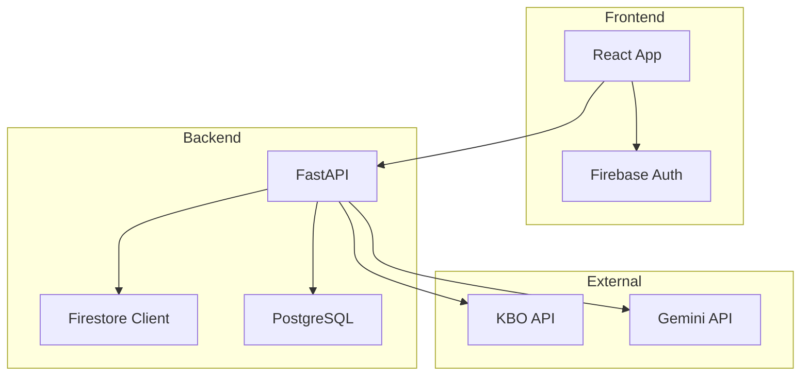
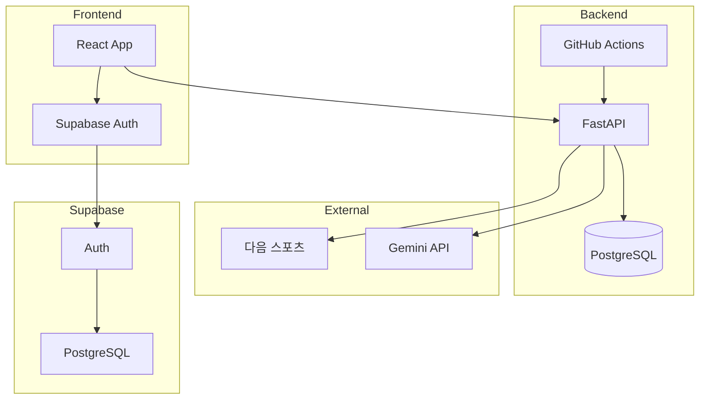
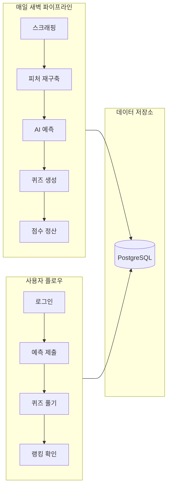
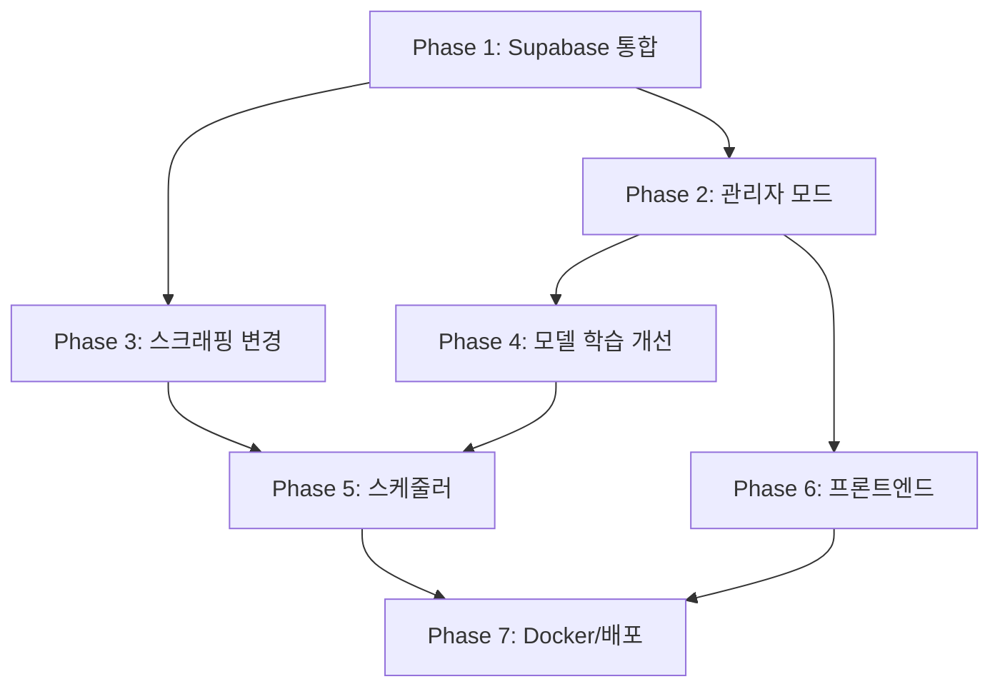

# Laions 프로젝트 리팩토링 계획

> 분석 기반: 2026-05-07, 전체 코드베이스 분석 완료

---

## 1. 현재 프로젝트 상태 분석

### 1.1 기술 스택 현황

| 계층 | 현재 | 리팩토링 목표 |
|------|------|--------------|
| **Frontend** | React 19 + MUI 7 | 유지 (버전 업그레이드) |
| **Backend** | FastAPI + SQLAlchemy | 유지 |
| **DB** | PostgreSQL (로컬) | PostgreSQL (Docker) |
| **Auth** | Firebase Auth + Firestore | **Supabase**로 통합 |
| **User Data** | Firebase Firestore (별도) | **Supabase**로 통합 |
| **AI Model** | LightGBM (pickle 파일) | 유지 |
| **Scheduler** | 없음 (수동 실행) | **GitHub Actions** 추가 |
| **Container** | Docker Compose (일부) | Docker Compose 개선 |
| **Scraping** | KBO `/ws/` API (robots.txt 위반) | **다음 스포츠**로 변경 |

### 1.2 주요 문제점

#### 🔴 Critical Issues

1. **스크래핑 방식 위반** (`crawler_service.py:14`)
   - KBO `ws/Schedule.asmx` API 사용 중 → `robots.txt`에서 차단된 경로
   - 다음 스포츠 등 허용된 소스로 변경 필요

2. **Firebase + PostgreSQL 이중 데이터 저장소**
   - 사용자 점수/랭킹: Firebase Firestore (`ranking_service.py:108-118`)
   - 경기 데이터/예측: PostgreSQL
   - 데이터 일관성 문제 및 관리 복잡성 증가

3. **관리자 모드 DB 분리 문제** (`config.py:15-26`)
   - `ADMIN_MODE`에 따라 `_admin` 접미사 테이블 사용
   - DB 테이블이 완전히 분리되어 관리자 모드 테스트 후 데이터 정리 어려움
   - 트랜잭션 롤백으로 대체 필요

4. **관리자 모드와 일반 모드의 비대칭 구조**
   - `admin_service.py`에서 config 모듈의 전역 변수를 직접 변경 (`admin_service.py:24-25`)
   - 일반 모드가 관리자 모드 로직을 참조하는 역전 현상

#### 🟡 Medium Issues

5. **모델 학습 검증셋 불필요** (`model_service.py:146-160`)
   - 2021~2024 학습, 2025 검증 → 전체 데이터 학습으로 변경 필요, 필요 시 2020년을 검증셋으로 활용
   - 오프시즌 재학습 로직은 유효

6. **퀴즈 생성기 프롬프트 개선 필요** (`quizmaker.py:40-69`)
   - 예시 데이터에 오답 포함되어 있음 (line 63: "홈런 아님, 문제 자체가 함정일 경우")
   - `internal_verification` 필드로 논리 검증 로직 추가됐으나 프롬프트 정교화 필요

7. **프론트엔드 단일 경기 예측 한계** (`PredictionCard.js:20-21`)
   - `predictions` 배열의 첫 번째 경기만 사용
   - 전 경기 예측으로 확장 시 UI 개선 필요

8. **스케줄러 미구현**
   - 매일 새벽 데이터 수집/예측/퀴즈 생성 자동화 필요
   - GitHub Actions로 구현 예정

#### 🟢 Minor Issues

9. **하드코딩된 상수**
   - `TEAMS` 리스트 (`config.py:45`), 점수 정책 (`ranking_service.py:17-25`)
   - 설정 파일 또는 DB로 분리 가능

10. **에러 처리 일관성**
    - 일부 서비스에서 `try-except`로 HTTPException 직접 raise
    - 글로벌 예외 핸들러로 통합 가능

11. **코드 중복**
    - `PredictionCard.js`와 `PostseasonCard.js`가 거의 동일한 구조
    - 컴포넌트 통합 가능

---

## 2. 리팩토링 상세 계획

### Phase 1: 데이터 저장소 통합 (Supabase 마이그레이션)

**목표**: Firebase Firestore → Supabase로 모든 사용자 데이터 이전

| 작업 | 상세 | 영향 파일 |
|------|------|-----------|
| 1.1 | Supabase 프로젝트 설정 및 테이블 생성 | `backend/supabase_config.py` (신규) |
| 1.2 | 사용자 프로필/점수 테이블 Supabase에 생성 | `init_db.sql` 수정 |
| 1.3 | `ranking_service.py` Firestore 의존성 제거 → Supabase로 대체 | `ranking_service.py` |
| 1.4 | `main.py` 퀴즈 점수 Firestore 업데이트 로직 Supabase로 변경 | `main.py:132-141` |
| 1.5 | 프론트엔드 Firebase Auth → Supabase Auth로 마이그레이션 | `firebase.js`, `LoginPage.js` |
| 1.6 | Firebase 관련 파일 정리 | `firebase_config.py`, `firebase.js` |

**Supabase 테이블 스키마 (추가)**:
```sql
-- 사용자 프로필 (Supabase Auth.users와 연동)
CREATE TABLE user_profiles (
    user_id UUID PRIMARY KEY REFERENCES auth.users(id),
    nickname VARCHAR(50),
    total_score INTEGER DEFAULT 0,
    weekly_score INTEGER DEFAULT 0,
    prediction_score INTEGER DEFAULT 0,
    quiz_score INTEGER DEFAULT 0,
    updated_at TIMESTAMP DEFAULT NOW()
);
```

### Phase 2: 관리자 모드 리팩토링

**목표**: 관리자 모드를 단순 날짜 주입 방식으로 변경, 트랜잭션 롤백 적용

| 작업 | 상세 | 영향 파일 |
|------|------|-----------|
| 2.1 | `config.py`에서 `ADMIN_MODE` 분기 테이블 제거 | `config.py:15-26` |
| 2.2 | 모든 서비스에서 `TABLE_*_ADMIN` 참조 제거 | `config.py`, `main.py`, `crawler_service.py`, `feature_service.py`, `model_service.py` |
| 2.3 | `admin_service.py`에 트랜잭션 롤백 로직 추가 | `admin_service.py` |
| 2.4 | 관리자 모드 API 단순화 (날짜 변경만 담당) | `admin_service.py` |
| 2.5 | DB에서 `_admin` 테이블들 제거 (마이그레이션 스크립트) | `init_db.sql` |

**트랜잭션 롤백 설계**:
```python
# admin_service.py (개선안)
@router.post("/date")
def set_date(new_date: str):
    # 1. 현재 DB 상태 스냅샷 저장 (SAVEPOINT)
    # 2. 날짜 변경 후 모든 파이프라인 실행
    # 3. 세션 종료 시 ROLLBACK (실제 DB 변경 없음)
    # 4. 읽기 전용 트랜잭션으로 관리자 모드 구현
```

### Phase 3: 스크래핑 방식 변경

**목표**: KBO API → 다음 스포츠 API로 변경

| 작업 | 상세 | 영향 파일 |
|------|------|-----------|
| 3.1 | 다음 스포츠 API 분석 및 새 크롤러 구현 | `crawler_service.py` |
| 3.2 | 기존 KBO API 호출 로직 제거 | `crawler_service.py` |
| 3.3 | 포스트시즌 일정 스크래핑 로직 추가 | `crawler_service.py` |
| 3.4 | `robots.txt` 준수 확인 | `docs/robots.txt` |

### Phase 4: 모델 학습 파이프라인 개선

**목표**: 검증셋 제거, 전체 데이터 학습으로 변경

| 작업 | 상세 | 영향 파일 |
|------|------|-----------|
| 4.1 | `ModelPipeline.run_pipeline()` 학습 데이터 범위 단순화 | `model_service.py:141-165` |
| 4.2 | 시즌 중에도 당해 데이터 포함 학습 (누적 학습) | `model_service.py` |
| 4.3 | 모델 성능 메트릭 로깅 추가 | `model_service.py` |

### Phase 5: 스케줄러 구현 (GitHub Actions)

**목표**: 매일 새벽 자동화 파이프라인 구축

| 작업 | 상세 | 영향 파일 |
|------|------|-----------|
| 5.1 | GitHub Actions 워크플로우 파일 생성 | `.github/workflows/daily_pipeline.yml` |
| 5.2 | 일일 파이프라인 스크립트 작성 | `backend/daily_pipeline.py` (신규) |
| 5.3 | 작업 순서: 스크래핑 → 피처 재구축 → 예측 → 퀴즈 생성 → 점수 정산 | `daily_pipeline.py` |
| 5.4 | 워크플로우에서 Docker Compose 실행 | `.github/workflows/daily_pipeline.yml` |

### Phase 6: 프론트엔드 개선

**목표**: 전 경기 예측 표시, UI 개선, 중복 제거

| 작업 | 상세 | 영향 파일 |
|------|------|-----------|
| 6.1 | `PredictionCard`와 `PostseasonCard` 통합 | `PredictionCard.js`, `PostseasonCard.js` |
| 6.2 | 전 경기 예측 리스트 UI 구현 | `PredictionCard.js` |
| 6.3 | 삼성 라이온즈 역사 섹션 추가 | `HistoryCard.js` (신규) |
| 6.4 | 리그 순위에서 삼성 강조 표시 | `LeagueStandingsCard.js` |
| 6.5 | 관리자 모드 UI (날짜 선택기) 추가 | `AdminPanel.js` (신규) |
| 6.6 | `Dashboard.js` 모드별 렌더링 로직 개선 | `Dashboard.js` |

### Phase 7: Docker 및 배포 환경 개선

**목표**: Docker Compose 완전 지원, 배포 용이성 확보

| 작업 | 상세 | 영향 파일 |
|------|------|-----------|
| 7.1 | `.env.example` 파일 생성 (필수 변수 명세) | `.env.example` (신규) |
| 7.2 | `docker-compose.yml` healthcheck 개선 | `docker-compose.yml` |
| 7.3 | Supabase 연동을 위한 환경 변수 추가 | `docker-compose.yml` |
| 7.4 | Nginx 설정 추가 (프론트엔드 정적 파일 서빙) | `frontend/nginx.conf` (신규) |

---

## 3. 아키텍처 다이어그램

### 3.1 현재 아키텍처



### 3.2 리팩토링 후 아키텍처



### 3.3 데이터 흐름 (리팩토링 후)



---

## 4. Phase별 실행 순서 및 의존성



---

## 5. 상세 작업 목록 (Todo)

### Phase 1: Supabase 마이그레이션
- [ ] 1.1 Supabase 프로젝트 생성 및 설정
- [ ] 1.2 `backend/supabase_config.py` 생성
- [ ] 1.3 `ranking_service.py` Firestore → Supabase 리팩토링
- [ ] 1.4 `main.py` 퀴즈 점수 저장 로직 Supabase로 변경
- [ ] 1.5 프론트엔드 Firebase Auth → Supabase Auth 마이그레이션
- [ ] 1.6 Firebase 관련 파일 제거 및 정리

### Phase 2: 관리자 모드 리팩토링
- [ ] 2.1 `config.py` ADMIN_MODE 분기 테이블 제거
- [ ] 2.2 모든 서비스에서 `TABLE_*_ADMIN` 참조 제거
- [ ] 2.3 `admin_service.py` 트랜잭션 롤백 로직 구현
- [ ] 2.4 DB 마이그레이션 스크립트 작성 (`_admin` 테이블 제거)

### Phase 3: 스크래핑 방식 변경
- [ ] 3.1 다음 스포츠 API 분석
- [ ] 3.2 새 크롤러 구현 (다음 스포츠 기반)
- [ ] 3.3 포스트시즌 일정 스크래핑 로직 추가
- [ ] 3.4 기존 KBO API 호출 로직 제거

### Phase 4: 모델 학습 개선
- [ ] 4.1 학습 데이터 범위 단순화 (전체 데이터 사용)
- [ ] 4.2 모델 성능 메트릭 로깅 추가

### Phase 5: 스케줄러 구현
- [ ] 5.1 `backend/daily_pipeline.py` 생성
- [ ] 5.2 `.github/workflows/daily_pipeline.yml` 생성
- [ ] 5.3 파이프라인 작업 순서 구현

### Phase 6: 프론트엔드 개선
- [ ] 6.1 `PredictionCard` + `PostseasonCard` 통합
- [ ] 6.2 전 경기 예측 리스트 UI 구현
- [ ] 6.3 삼성 라이온즈 역사 섹션 추가
- [ ] 6.4 관리자 모드 UI (날짜 선택기) 추가
- [ ] 6.5 `Dashboard.js` 모드별 렌더링 개선

### Phase 7: Docker 및 배포
- [ ] 7.1 `.env.example` 생성
- [ ] 7.2 `docker-compose.yml` 개선
- [ ] 7.3 Nginx 설정 추가
- [ ] 7.4 README 업데이트
